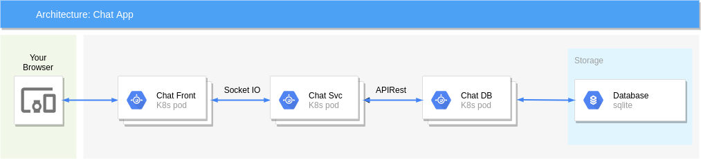
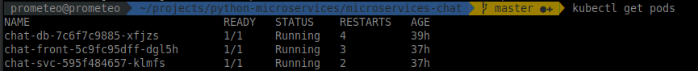
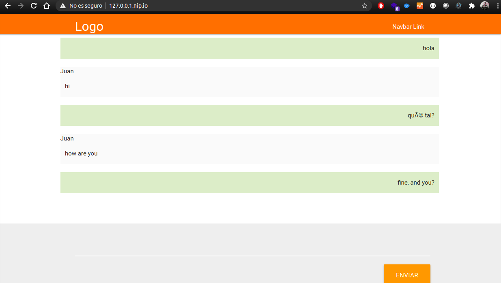

# 💬 Chat App Microservices Example

This project demonstrates a real-world implementation of a chat application using microservices architecture, deployed within a Kubernetes cluster. It serves as a practical showcase for our [PyMS](https://github.com/your-org/pyms) library, its project template, and scaffold.

---

## 🎯 Objective

To provide a working example of a microservices-based system built with PyMS, including real-time communication and persistent storage. This example helps developers understand the structure and interaction of microservices within a containerized environment.

---

## 📦 Microservices Overview

### 1. `chat_front` (Frontend Service)
- A simple web interface.
- Uses **Socket.IO** to send and receive messages in real time.
- Connects to `chat_svc` for messaging.

### 2. `chat_svc` (Chat Service)
- Handles incoming messages from `chat_front`.
- Forwards messages to `chat_db` for persistence.
- Acts as a middleware between frontend and backend.

### 3. `chat_db` (Database Service)
- Stores chat messages in a **SQLite** database.
- Receives data from `chat_svc` via HTTP or gRPC (depending on implementation).

---

## 🛠️ Tech Stack

- **Python** with [PyMS](https://github.com/your-org/pyms)
- **Socket.IO**
- **SQLite**
- **Kubernetes** for orchestration
- **Docker** for containerization

---

## Architecture




## Step 1: Configure The Platform
The first step for working with Kubernetes clusters is to have Minikube installed if you have selected to work locally.

Install Minikube in your local system, either by using a virtualization software such as VirtualBox or a local terminal.

* Browse to the [Minikube latest releases page](https://github.com/kubernetes/minikube/releases).

* Select the distribution you wish to download depending on your Operating System.

  NOTE: This tutorial assumes that you are using Mac OSX or Linux OS. The Minikube installer for Windows is under development. To get an experimental release of Minikube for Windows, check the Minikube releases page.

* Open a new console window on the local system or open your VirtualBox.

* To obtain the latest Minikube release, execute the following command depending on your OS. Remember to replace the X.Y.Z and OS_DISTRIBUTION placeholders with the latest version and software distribution of Minikube respectively. Check the Minikube latest releases page for more information on this.

  ```bash
  curl -Lo minikube https://storage.googleapis.com/minikube/releases/vX.Y.Z/minikube-OS_DISTRIBUTION-amd64 && chmod +x minikube && sudo mv minikube /usr/local/bin/
  ```

  TIP: If you use homebrew you can install it with the brew install command: `brew install minikube`.

## Step 2: Create A Kubernetes Cluster
By starting Minikube, a single-node cluster is created. Run the following command in your terminal to complete the creation of the cluster:

```bash
minikube start
```


Install ingress:

```
minikube addons enable ingress
```

Set the environment of docker. This will make you shell use minikube's docker, so any image you build, you'll build it in the minikube machine. With this, you won't need a docker registry:
```bash
eval $(minikube docker-env)
```

To run your commands against Kubernetes clusters, the kubectl CLI is needed. Check step 3 to complete the installation of kubectl.

## Step 3: Install The Kubectl Command-Line Tool
In order to start working on a Kubernetes cluster, it is necessary to install the Kubernetes command line (kubectl). Follow these steps to install the kubectl CLI:

* Execute the following commands to install the kubectl CLI. OS_DISTRIBUTION is a placeholder for the binary distribution of kubectl, remember to replace it with the corresponding distribution for your Operating System (OS).

  ```bash
  curl -LO https://storage.googleapis.com/kubernetes-release/release/$(curl -s https://storage.googleapis.com/kubernetes-release/release/stable.txt)/bin/OS_DISTRIBUTION/amd64/kubectl
  chmod +x ./kubectl
  sudo mv ./kubectl /usr/local/bin/kubectl
  ```
  
  TIP: Once the kubectl CLI is installed, you can obtain information about the current version with the kubectl version command.

  NOTE: You can also install kubectl by using the `sudo apt-get install kubectl` command. If you use homebrew you can install it with the brew install command: `brew install kubectl`.

* Check that kubectl is correctly installed and configured by running the kubectl cluster-info command:

  ```bash
  kubectl cluster-info
  ```
  
  NOTE: The kubectl cluster-info command shows the IP addresses of the Kubernetes node master and its services.

  

* You can also verify the cluster by checking the nodes. Use the following command to list the connected nodes:
  
  ```bash
  kubectl get nodes
  ```
  


* To get complete information on each node, run the following:

  ```bash
  kubectl describe node
  ```
  

[Learn more about the kubectl CLI](https://kubernetes.io/docs/user-guide/kubectl-overview/).

## Step 4: Install Helm 
The easiest way to run and manage applications in a Kubernetes cluster is using Helm. Helm allows you to perform key operations for managing applications such as install, upgrade or delete.

* To install Helm, run the following commands:

  ```bash
  curl https://raw.githubusercontent.com/kubernetes/helm/master/scripts/get > get_helm.sh
  chmod 700 get_helm.sh
  ./get_helm.sh
  ```
  
  TIP: If you use homebrew you can install it with the brew install command: `brew install kubernetes-helm`.

Once you have installed Helm, a set of useful commands to perform common actions is shown below:


## Step 5

Create the docker images:

  ```bash
  docker build -t chat_db:v1 -f chat_db/Dockerfile chat_db/
  docker build -t chat_svc:v1 -f chat_svc/Dockerfile chat_svc/
  docker build -t chat_front:v1 -f chat_front/Dockerfile chat_front/
  ```
  
Check your helm charts:

  ```bash
  helm upgrade --dry-run --install chat-front ./chat_front/chat_front/ \
    --set ingress.enabled=true --set "ingress.hosts[0]=$(minikube ip).nip.io"
  helm upgrade --dry-run --install chat-svc ./chat_svc/chat_svc/ --set \
    --set ingress.enabled=true --set "ingress.hosts[0]=svc.$(minikube ip).nip.io"
  helm upgrade --dry-run --install chat-db ./chat_db/chat_db/
  ```

Install helm charts:

  ```bash
  helm upgrade --install chat-front ./chat_front/chat_front/ \
    --set ingress.enabled=true --set "ingress.hosts[0]=$(minikube ip).nip.io"
  helm upgrade --install chat-svc ./chat_svc/chat_svc/ --set \
    --set ingress.enabled=true --set "ingress.hosts[0]=svc.$(minikube ip).nip.io"
  helm upgrade --install chat-db ./chat_db/chat_db/
  ```

## Step 6

Verify that all pods are Ok:

  ```bash
  kubectl get pods
  ```



## Step 7

Open the IP that the command `minikube ip` returns and see the magic! ;)


